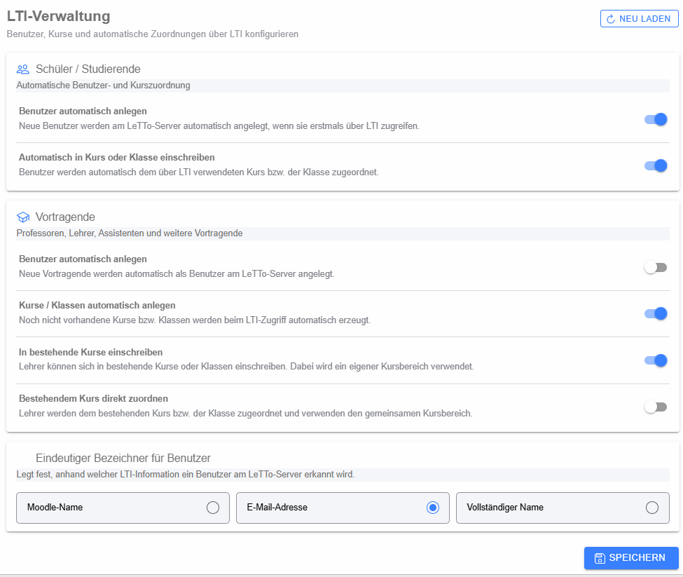

# LTI-Konfiguration

Die Seite **LTI-Verwaltung** konfiguriert, wie Benutzer und Kurse/Klassen beim Zugriff über LTI automatisch in LeTTo angelegt und zugeordnet werden.

## Schüler / Studierende

Für Lernende stehen zwei getrennte Optionen zur Verfügung:

- **Benutzer automatisch anlegen** – ein noch nicht vorhandener Benutzer wird beim ersten LTI-Zugriff automatisch am LeTTo-Server angelegt.
- **Automatisch in Kurs oder Klasse einschreiben** – der Benutzer wird dem über LTI verwendeten Kurs bzw. der Klasse zugeordnet.

## Vortragende

Für Professoren, Lehrer, Assistenten und weitere Vortragende können folgende Automatismen aktiviert werden:

- **Benutzer automatisch anlegen** – neue Vortragende werden als LeTTo-Benutzer erzeugt.
- **Kurse / Klassen automatisch anlegen** – ein über LTI aufgerufener, noch nicht vorhandener Kurs bzw. eine Klasse wird automatisch erstellt.
- **In bestehende Kurse einschreiben** – Vortragende können sich in bestehende Kurse/Klassen einschreiben und verwenden dabei einen eigenen Kursbereich.
- **Bestehendem Kurs direkt zuordnen** – Vortragende werden dem vorhandenen Kurs bzw. der Klasse direkt zugeordnet und verwenden den gemeinsamen Kursbereich.

## Eindeutiger Bezeichner für Benutzer

Diese Einstellung bestimmt, anhand welcher LTI-Information LeTTo einen Benutzer wiedererkennt. Zur Auswahl stehen:

- **Moodle-Name**
- **E-Mail-Adresse**
- **Vollständiger Name**

Die Wahl sollte zur Benutzerverwaltung der angebundenen Lernplattform passen, damit bei wiederholten LTI-Aufrufen keine unerwünschten Doppelkonten entstehen.

## Speichern und neu laden

**Speichern** überträgt die aktuelle schulbezogene Konfiguration. **Neu laden** verwirft nicht gespeicherte Änderungen und liest die Daten erneut vom Backend. Kann die Konfiguration nicht vollständig geladen werden, zeigt die Seite einen Warnhinweis und verwendet zunächst Standardwerte.
