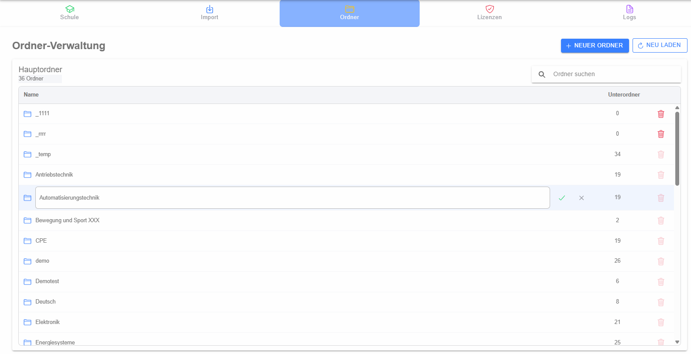

# Ordner / Kategorien

Die Ordner-Verwaltung pflegt die Hauptordner des Kategoriebaums. Sie zeigt die vorhandenen Hauptordner, deren Reihenfolge bzw. Inhaltssituation und die möglichen Verwaltungsaktionen.

## Suchen und aktualisieren

Über die Suche kann die Liste nach Ordnernamen gefiltert werden. **Neu laden** lädt die Daten erneut vom Backend.

## Hauptordner anlegen

Mit **Neuer Hauptordner** wird der [Dialog zum Anlegen eines Hauptordners](dialog-neuer-hauptordner/index.md) geöffnet.

## Umbenennen

Für einen vorhandenen Ordner kann die Bearbeitung des Namens direkt in der Liste aktiviert werden. Die Änderung wird mit Speichern übernommen oder mit Abbrechen verworfen.

## Löschen

Ein Hauptordner kann nur unter den vom Backend erlaubten Bedingungen entfernt werden. Vor dem Löschen wird eine Sicherheitsabfrage angezeigt. Enthält der Ordner Daten oder bestehen Abhängigkeiten, kann das Backend den Löschvorgang ablehnen.
