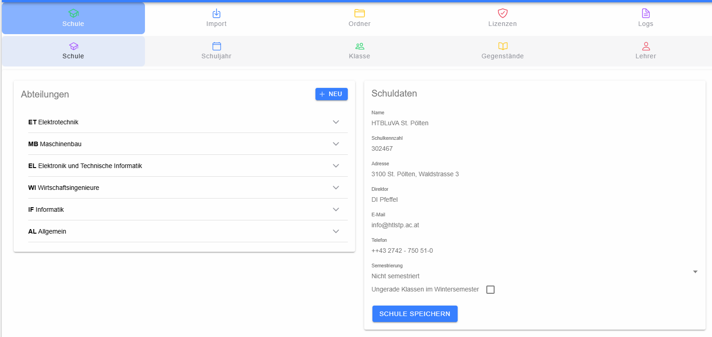

# Schule und Abteilungen

Die Seite **Schule** verwaltet die Stammdaten der Schule sowie deren Abteilungen. Links werden die Abteilungen angezeigt, rechts befinden sich die Schuldaten.

## Abteilungen

Mit **Neu** wird ein Eingabebereich für eine neue Abteilung geöffnet. Für eine Abteilung können **Kurzbezeichnung**, **Name**, **E-Mail** und **Telefon** erfasst werden. Ein Klick auf eine vorhandene Abteilung klappt deren Bearbeitungsbereich auf; ein erneuter Klick schließt ihn wieder.

Neue oder geänderte Abteilungen werden erst mit **Speichern** übernommen. **Löschen** ist nur bei bereits gespeicherten Abteilungen verfügbar und erfordert eine zusätzliche Bestätigung.

## Schuldaten

Im rechten Bereich können folgende Stammdaten geändert werden:

- Name und Schulkennzahl
- Adresse
- Direktor bzw. Leitung
- E-Mail und Telefon
- Semestrierung
- Kennzeichnung, ob ungerade Klassen im Wintersemester geführt werden

Die Semestrierung kann als **Nicht semestriert**, **Ganzes Jahr** oder **wechselnd** geführt werden. Änderungen werden mit **Schule speichern** an das Backend übertragen.
