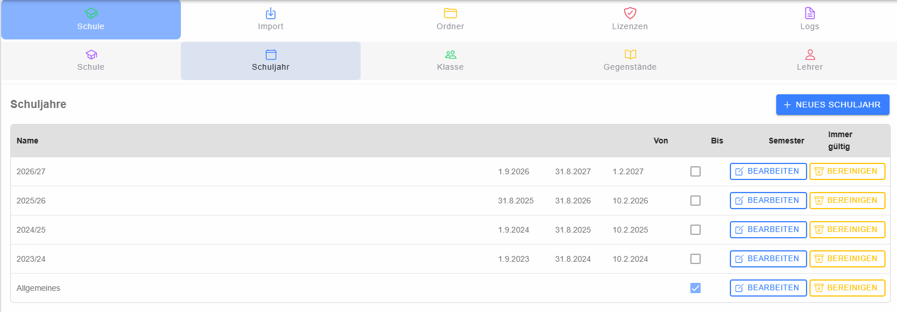

# Schuljahre

Die Schuljahresverwaltung zeigt alle vorhandenen Schuljahre, absteigend nach Beginn sortiert. Zu jedem Eintrag werden Name, Beginn, Ende, Semesterwechsel und die Kennzeichnung **Immer gültig** angezeigt. Auf schmalen Bildschirmen können zusätzliche Aktionen durch Aufklappen eines Eintrags eingeblendet werden.

## Schuljahr anlegen oder bearbeiten

Mit **Neues Schuljahr** wird der [Schuljahr-Dialog](dialog-schuljahr/index.md) geöffnet. Vorhandene Einträge können über **Bearbeiten** geändert werden. Änderungen werden erst nach dem Speichern des Dialogs übernommen.

## Daten bereinigen

Für ein Schuljahr kann eine Datenbereinigung gestartet werden. Dabei wird zuerst ausgewählt, welche Daten entfernt werden sollen:

- Testantworten
- Testversuche
- alle Beurteilungen
- alle Daten des Schuljahres

Vor dem Start ist eine zweite Bestätigung erforderlich. Die Bereinigung läuft als Hintergrundtransaktion; der Fortschritt wird in einem [Statusdialog](../logs/dialog-status/index.md) angezeigt. Das Schließen dieses Statusdialogs beendet den Backend-Prozess nicht.

> **Achtung:** Insbesondere **Alle Daten des Schuljahres** ist ein weitreichender Löschvorgang. Die Auswahl und das betroffene Schuljahr müssen vor der Bestätigung geprüft werden.
