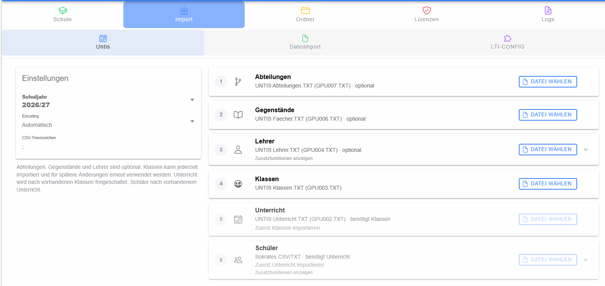
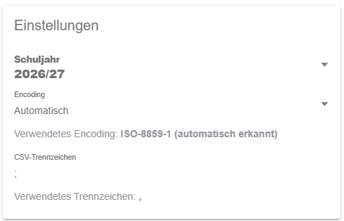
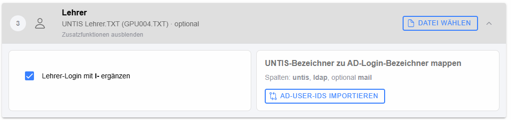
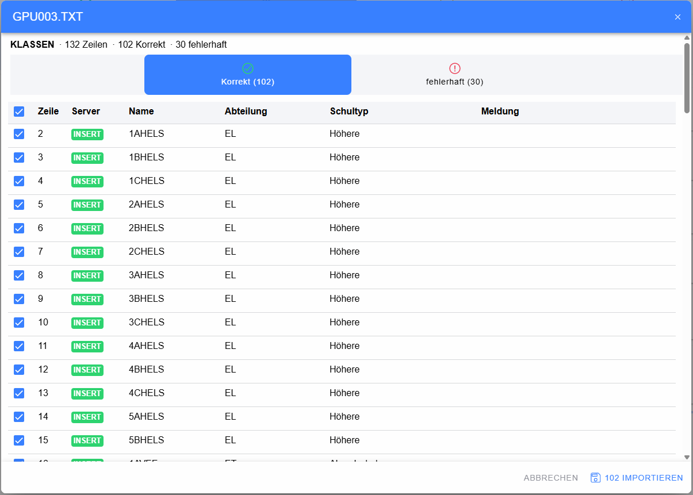
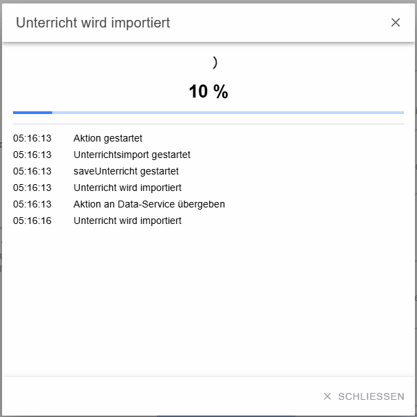
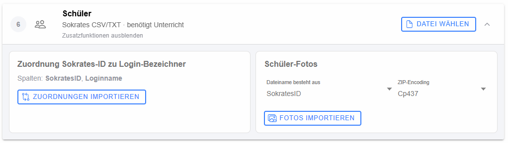

# Untis-/Sokrates-Import

Der Untis-Import führt schrittweise durch die Übernahme der für ein Schuljahr benötigten Stammdaten, Unterrichtsdaten und Schülerdaten. Die Reihenfolge ist teilweise voneinander abhängig und wird von der Oberfläche entsprechend freigeschaltet.

## Einstellungen

Vor dem Import wird das Ziel-Schuljahr gewählt. Zusätzlich können Encoding und CSV-Trennzeichen festgelegt werden. Bei automatischer Erkennung zeigt LeTTo das tatsächlich erkannte Encoding bzw. Trennzeichen an.

## Importschritte

Die Importbereiche sind:

1. **Abteilungen** – Untis-Abteilungsdatei, optional
2. **Gegenstände** – Untis-Fächerdatei, optional
3. **Lehrer** – Untis-Lehrerdatei, optional
4. **Klassen** – Untis-Klassendatei
5. **Unterricht** – benötigt einen abgeschlossenen Klassenimport
6. **Schüler** – Sokrates-Daten, benötigt den abgeschlossenen Unterrichtsimport

Dateien werden zunächst gelesen, geparst und in einem [Prüfdialog](dialog-vorschau/index.md) angezeigt. Erst die dort ausgewählten gültigen Datensätze werden übernommen.

## Ergänzende Lehrer-Daten

Im Lehrerbereich können ergänzende Zuordnungsdaten importiert werden, insbesondere eine Abbildung von Untis-Lehrerbezeichnern auf AD-Loginbezeichner. Je nach Konfiguration kann außerdem die Bildung des Lehrer-Logins beeinflusst werden.

## Klassenimport

Beim Klassenimport werden die erkannten Datensätze samt Status kontrolliert. Die Übernahme erfolgt erst nach Bestätigung im Prüfdialog.

## Unterricht und längere Prozesse

Der Unterrichtsimport kann als länger laufende Hintergrundtransaktion gestartet werden. Während der Verarbeitung zeigt LeTTo den Fortschritt und Statusmeldungen an.

Der zugehörige [Statusdialog](../logs/dialog-status/index.md) kann geschlossen werden, ohne den Backend-Prozess abzubrechen.

## Schüler und Zusatzdaten

Nach abgeschlossenem Unterrichtsimport können Schülerdaten übernommen werden. Zusätzlich unterstützt die Oberfläche unter anderem Sokrates-/Login-Zuordnungen und den Import von Schülerfotos. Fotoimporte können ebenfalls als Hintergrundtransaktion laufen.
