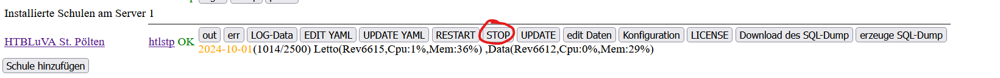

# Migration einer bestehenden Docker-Installation auf einen neuen Server

## Sicherung der Daten des bestehnden Servers
1. LeTTo-Server der Schule stoppen im Setup-Service 
2. Datenbanksicherung erstellen<pre>docker exec -it letto-mysql export letto-schulkürzel</pre>
   Bitte statt letto-schulkürzel den wirklichen Namen der Datenbank verwenden.
   Die Sicherung wird dann in der Datei /opt/letto/docker/storage/database-dump/letto-schulkürzel.sql  
   erscheinen - bitte Datum und Dateigröße kontrollieren.
   <pre>ls /opt/letto/docker/storage/database-dump -al</pre>
3. Verzeichnis /opt/letto in eine Datei packen <pre>cd /opt
tar -czf letto.tgz letto</pre>
4. Die erstellte Datei letto.tgz enthält nun alle Daten die am neuen Server benötigt werden!

## Den neuen Server mit Ubuntu 22.04 server installieren
Bei einem virtuellen Server ist folgendes zu beachten.
* keine 
