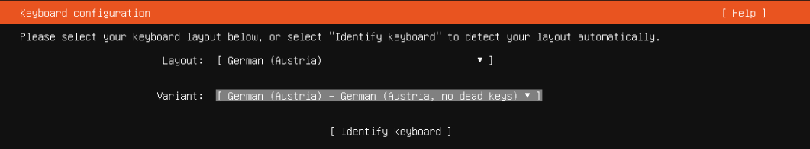
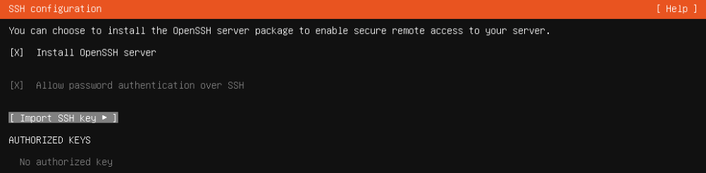
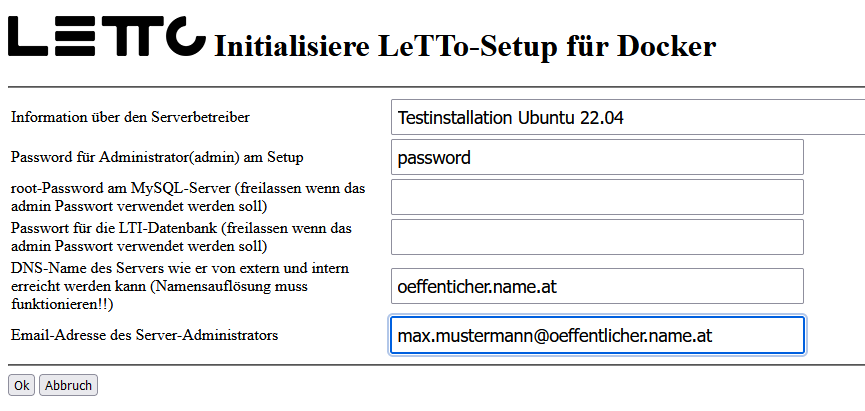
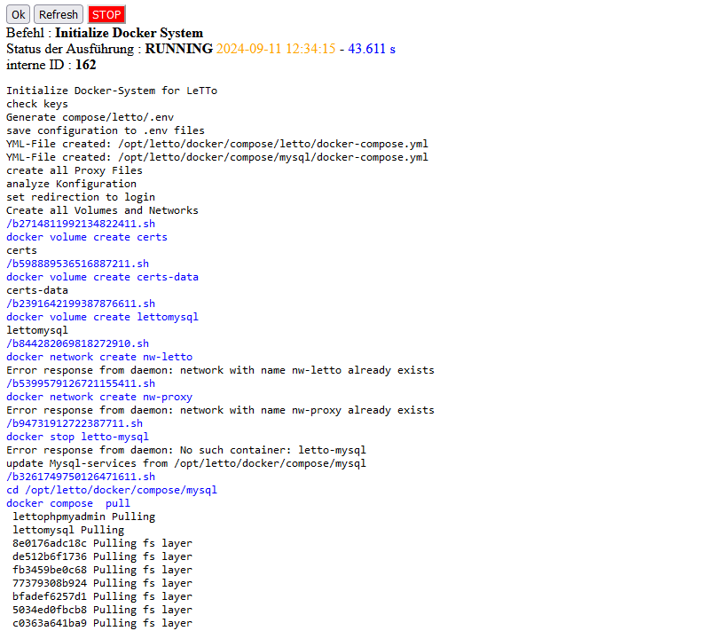

# Install Ubuntu 22.04
## Grundinstallation
* download Iso-Image von
* starte Ubuntu von Ubuntu-Server 22.04.4 ISO-Image
* Sprache - Deutsch
* Aktualisieren auf neuen Installer
* Keyboard: German(Austria) - No dead keys 
  * Ubuntu Server 
* Netzwerkkonfiguration einstellen
* kein Proxy
* Mirror belassen
* use entire disk
* Benutzer letto mit Passwort anlegen
* ohne Ubuntu-pro
* Install OpenSSH server
* kein weiteren Packages installieren (Vor allem nicht docker)
* Nach Installation den Rechner neu starten
## Konfiguration
als root
<pre>apt-get update -y
apt-get upgrade -y
apt-get dist-upgrade -y
apt-get autoremove -y
</pre>
## Installation von LeTTo
als root
<pre>cd /opt
wget https://build.letto.at/download/install/scripts/debian-ubuntu/install-letto-ubuntu-docker.sh
bash ./install-letto-ubuntu-docker.sh
</pre>
* Verbinde über den Browser mit '''https://ipadresse:3096/config'''

* Nun sollten alle notwendigen Docker-Container heruntergeladen und installiert werden 
* Warten bis die Zeit nicht mehr nach oben zählt und dann auf "Refresh"
* Nun sollte ein weiterer Login angefordert werden und dann das Setup in etwa so aussehen: 